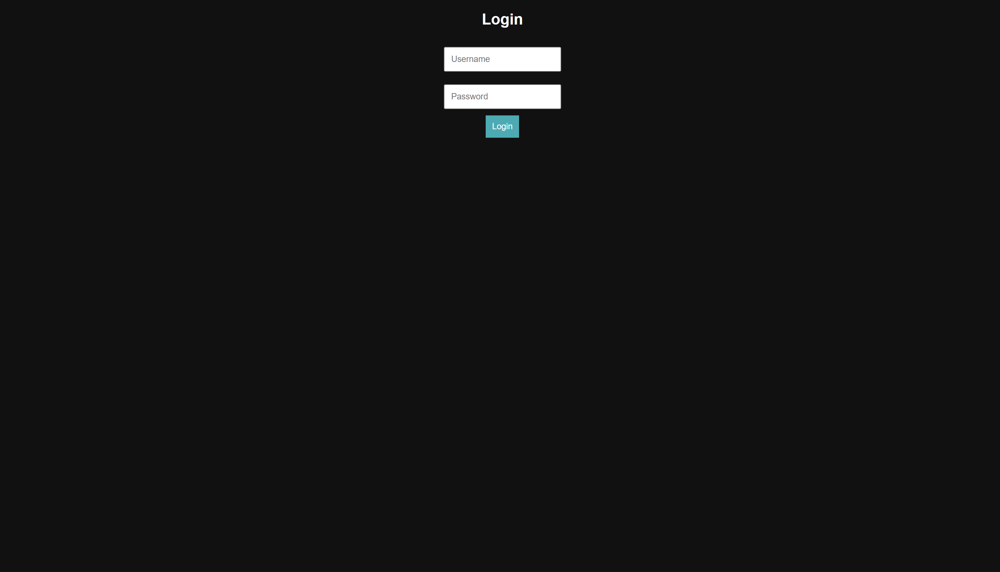
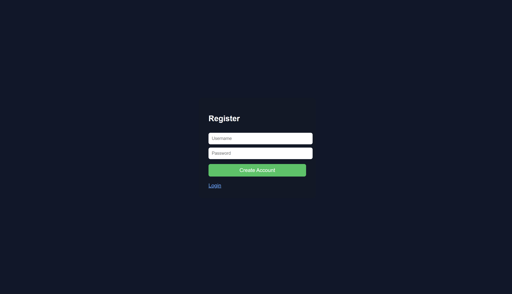
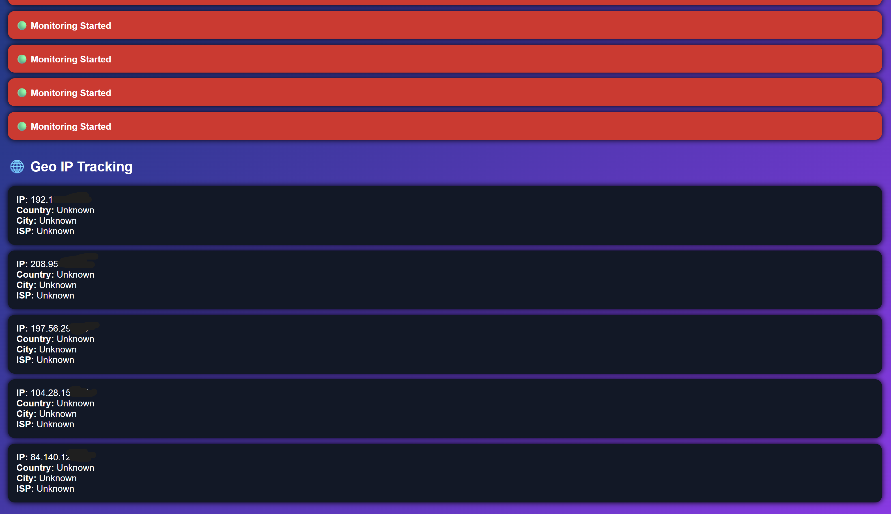
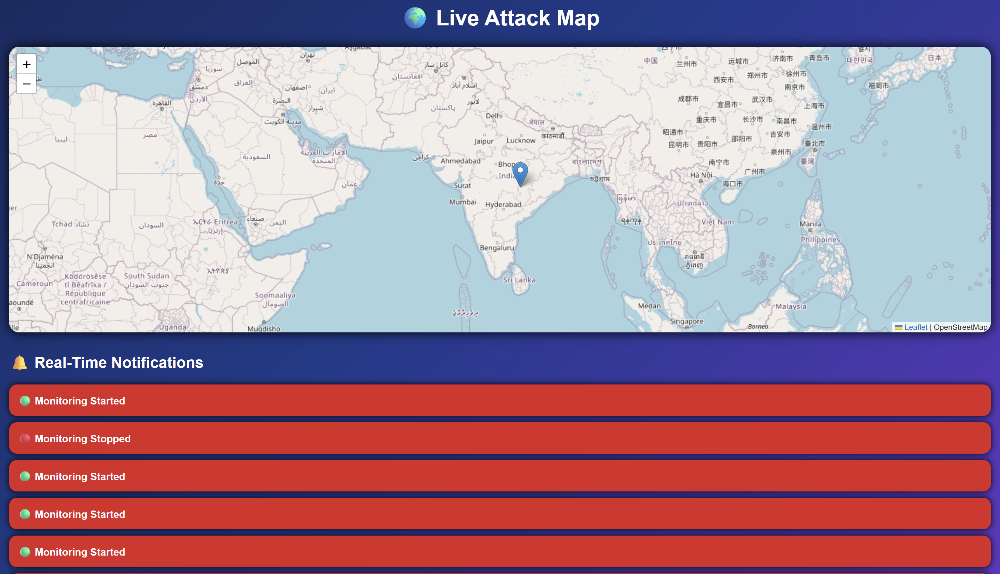
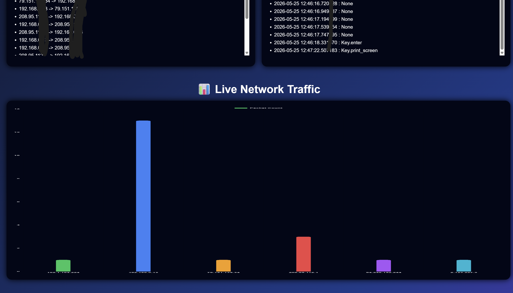
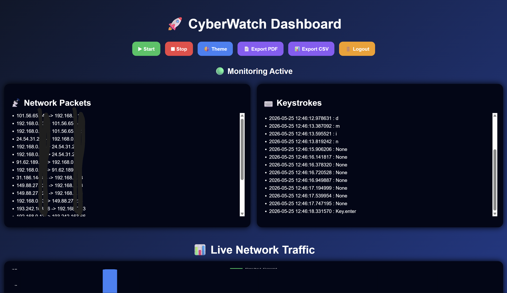

# CyberWatch Dashboard

Real-time cybersecurity monitoring dashboard built using Python and Flask.

## Features

- Network packet monitoring
- Keystroke monitoring
- AI anomaly detection
- Suspicious keyword alerts
- Live traffic visualization
- Responsive dashboard

## 📸 Screenshots

### 🔐 Login Page



---
### 🔐 REGISTER Page



---

### 📊 Geo IP tracking



---
### 🌍 live attack map



---
### 📊 live network traffic



---
### 🌍 network packets



```bash
pip install -r requirements.txt
python app.py
